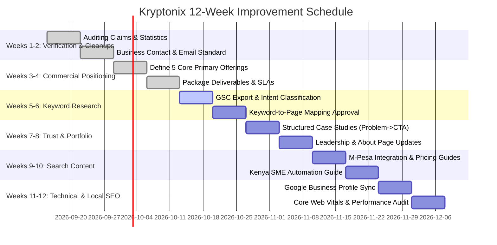

# Kryptonix Technologies: Content Evidence Folder & Keyword Research Strategy

This document serves as the authoritative content evidence repository specification, keyword research matrix, and 12-week execution schedule for **Kryptonix Technologies** as defined in the Website Improvement Brief.

---

## 1. Content Evidence Folder Inventory (Brief Section 2)

Before active web promotion or publishing claim-heavy collateral, the team must maintain documented evidence in the `docs/content_evidence/` repository.

| Evidence Item | Required Document / Asset | Status & Guideline |
| :--- | :--- | :--- |
| **Professional Profiles** | Founder & Leadership LinkedIn URLs, CVs, and bio statements | Verified profiles linked on About page |
| **Certifications** | Developer certifications (AWS, React, Python, Cisco, PMP) | Only display verified certifications |
| **Vendor Relationships** | Partner agreements or technology usage disclosures | Label section *"Technologies We Work With"* (not "Partners") unless official partnership exists |
| **Project Deliverables** | Source repositories, staging links, live sites for verified projects | Vortexus, Norwa Waters, Volem Water, Reesolmart, Nelda Eng |
| **Testimonial Approvals** | Written/signed approval from client representatives | Store PDFs/emails before publishing quotes |
| **Client Logos** | High-resolution SVG/PNG logos with written publishing consent | Only publish approved client logos |
| **Pricing Rules & SLAs** | Approved package bounds (e.g. Starter KES 35,000, Corporate KES 65,000) & SLA definitions | Maintain 1 business day response guarantee |
| **Terms & Policies** | Privacy Policy, Cookie Policy, SLA, Warranty & Maintenance terms | Aligned with Kenya Data Protection Act 2019 |

---

## 2. Master 15-Column Keyword Research Matrix (Brief Section 4 & 5)

The intern/SEO specialist must manage search terms using this exact 15-column schema:

| Keyword | Location | Monthly Searches | Trend | Intent | Difficulty | Current Position | Competitors | Target Page | Supporting Terms | Funnel Stage | Business Value (1-5) | Priority | Status |
| :--- | :--- | :--- | :--- | :--- | :--- | :--- | :--- | :--- | :--- | :--- | :--- | :--- | :--- |
| **website design Kenya** | Kenya | 1,900 | Growing | Commercial | Medium | Track in GSC | Top Local Agencies | `/services/website-design-development-kenya/` | web design company Kenya, website development Kenya | Consideration | 5 | P0 | Published |
| **website developers in Nairobi** | Nairobi | 1,300 | Stable | Transactional | Medium | Track in GSC | Local Web Firms | `/services/website-design-development-kenya/` | web design Nairobi, affordable website design Kenya | Purchase | 5 | P0 | Published |
| **ecommerce website development Kenya** | Kenya | 880 | Growing | Transactional | Medium | Track in GSC | E-com Agencies | `/services/ecommerce-website-development-kenya/` | online shop development Kenya, ecommerce developers Nairobi | Purchase | 5 | P0 | Published |
| **ecommerce website with M-Pesa integration** | Kenya | 720 | Growing | High-Intent | Low-Med | Track in GSC | FinTech Consultants | `/services/ecommerce-website-development-kenya/` | online store M-Pesa cost, Daraja API integration | Purchase | 5 | P0 | Published |
| **custom software development Kenya** | Kenya | 590 | Stable | Commercial | Medium | Track in GSC | Software Houses | `/services/software-development/` | business software solutions Kenya, custom business systems | Consideration | 4 | P1 | Published |
| **ERP software Kenya** | Kenya | 480 | Growing | Commercial | High | Track in GSC | ERP Vendors | `/services/enterprise-solutions/` | water company management software, custom inventory system | Consideration | 5 | P1 | Published |
| **POS system with M-Pesa integration** | Kenya | 540 | Growing | High-Intent | Medium | Track in GSC | POS Developers | `/services/enterprise-solutions/` | retail POS inventory Kenya, cashier system Nairobi | Purchase | 4 | P1 | Planned |
| **how much does a website cost in Kenya** | Kenya | 1,600 | Stable | Informational | Low | Track in GSC | Tech Blogs | `/resources/website-cost-in-kenya-guide/` | website design packages in Kenya, web development cost | Awareness | 4 | P1 | Planned |
| **M-Pesa API integration services Kenya** | Kenya | 420 | Growing | Transactional | Low | Track in GSC | Dev Studios | `/services/mpesa-integration-services/` | Daraja STK push developer, C2B callback setup | Purchase | 5 | P0 | Published |
| **business process automation Kenya** | Kenya | 320 | Growing | Commercial | Medium | Track in GSC | IT Consultancies | `/services/digital-transformation/` | workflow automation Nairobi, AI chatbot development | Consideration | 4 | P1 | Published |

---

## 3. 12-Week Intern Schedule & Execution Roadmap (Brief Section 10)

### Detailed Milestone Breakdown:

#### Weeks 1–2: Verification and Cleanup
- Audit every page for unverified claims.
- Replace placeholder stats with documented value propositions (*"Kenya-Based Team"*, *"Consultation Available"*).
- Update site email to `sales@kryptonixtechnologies.com` and purge dead social links.
- Test contact form, quote wizard, honeypot anti-spam, and WhatsApp floating widget.

#### Weeks 3–4: Commercial Positioning
- Consolidate navigation around 5 primary pillars (Business Websites, E-Commerce & M-Pesa, Custom Systems/ERP, Automation & AI, Cloud & Managed IT).
- Define package deliverables, turnaround times, starting price ranges, and SLA response guarantees (*"We respond within 1 business day"*).
- Rewrite homepage hero section with primary CTAs: **"Get a Website Quote"** and **"Book a Free 20-Minute Consultation"**.

#### Weeks 5–6: Keyword Research & Search Console Setup
- Export Google Search Console query logs filtered to Kenya mobile traffic.
- Complete 15-column keyword research spreadsheet.
- Assign primary search clusters to dedicated landing page URLs.

#### Weeks 7–8: Trust & Portfolio Overhaul
- Publish complete 7-step case studies for verified client projects (Vortexus, Norwa Waters, Volem Water, Reesolmart, Nelda Engineering).
- Exclude unapproved placeholder entries.
- Add verified technology stack relationships (*"Technologies We Work With"*).

#### Weeks 9–10: Search Content Articles
- Publish high-intent guides:
  1. *Website Design & Development Cost Guide in Kenya*
  2. *E-Commerce & Daraja M-Pesa Integration Best Practices*
  3. *Business Process Automation Checklist for Kenyan SMEs*

#### Weeks 11–12: Technical, Local & GEO SEO Validation
- Validate dynamic sitemap, canonicals, security headers, and JSON-LD schema (Organization, LocalBusiness, Service, FAQ).
- Optimize Google Business Profile consistency in Nairobi.
- Measure Core Web Vitals (LCP < 2.5s, INP < 200ms, CLS < 0.1) using PageSpeed Insights.
